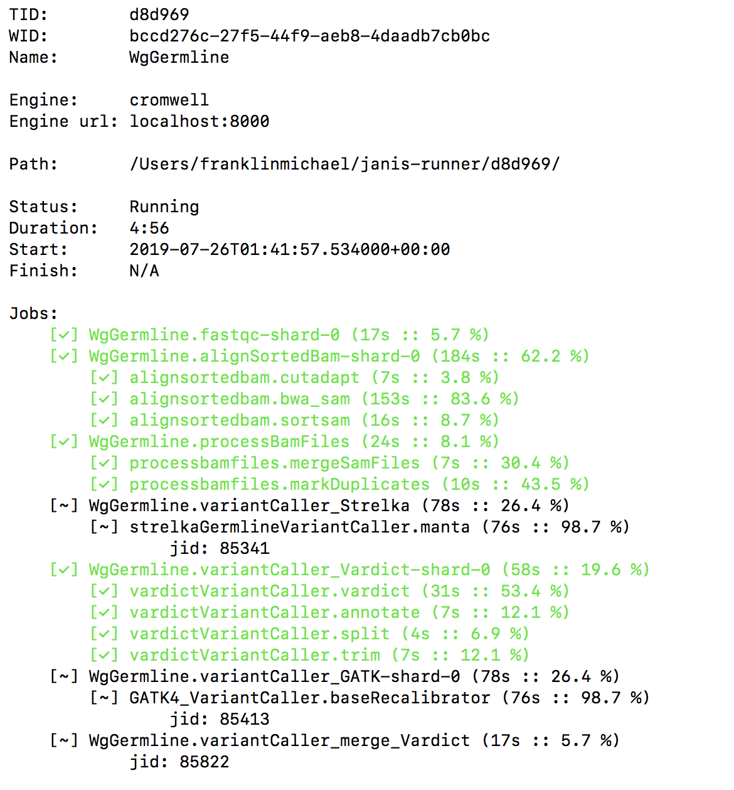

# Welcome to Janis-Runner

[](https://travis-ci.org/PMCC-BioinformaticsCore/janis-runner)
[](https://badge.fury.io/py/janis-pipelines.runner)

[Janis](https://github.com/PMCC-BioinformaticsCore/janis). is a workflow assistant designed 
to make the process of building and running workflows easier. 

## Quick start

```bash
pip3 install janis-pipelines[runner]
```

You can run a workflow in CWLTool with the following command line: 
```bash
janis run myWorkflow.py --engine cwltool
```

## Configuration

It's possible to configure a number of attributes of `janis.runner`. 
You can provide a YAML configuration file in two ways:

- CLI: `--config /path/to/config.yml`
- Environment variable `JANIS_CONFIGPATH=/path/to/config.yml`
- Default: `$(HOME)/.janis/janis.conf` - will additionally look for a config here.

> Configurations aren't currently cascaded, but the intention is they will.

### Options

Defaults: [`janis_runner/management/configuration.py`](https://github.com/PMCC-BioinformaticsCore/janis-runner/blob/master/janis_runner/management/configuration.py#L68)

- Config / DB directory: `configDir: /path/to/configir/`
    - Second priority to environment variable: `JANIS_CONFIGDIR`
    - Default: `(HOME)/.janis/`
    - Database: `{configDir}/janis.db` - Janis global database
    
- Execution directory: `executionDir`
    - Second priority to environment variable: `JANIS_EXCECUTIONDIR`
    - Default: `(HOME)/janis/execution/`
    
- Search paths: `searchPaths`
    - Will additionally add from environment variable: `JANIS_SEARCHPATH`
    - Default: `(HOME)/janis/`


## Engines

There are currently 2 engines that `janis.runner` supports:

1. CWLTool
2. Cromwell

### CWLTool (default)
    
Due to the way CWLTool provides metadata, support for CWLTool is very basic, and limited to submitting 
workflows and linking the outputs. It doesn't allow you to disconnect and reconnect later. It's enough 
as a proof of concept and for very basic workflows. 

You should include the `--logDebug` parmeter to see the output of CWLTool. 

### Cromwell

Cromwell can be run in two modes:

1. Connect to an existing instance (well supported) - include the `--cromwell-url` argument with the port to 
    allow Janis.runner to correctly connect to this instance.
    
2. Run and manage it's own instance (very limited) - Currently not very well supported, the main problem is for reporting, 
janis will spin up a server instance of Cromwell, but can sometimes lose the Cromwell instance (The process id is logged on start, or you can find it with `pgrep java`).

Both of these options provide reporting and progress tracking due to Cromwell's extensive metadata endpoint. The TaskID
(6 hex characters) is included as a label on the workflow. You can disconnect from a job and reconnect with this TaskID
through the command:

```bash
janis watch $tid
``` 

A screenshot of the running the example [whole genome germline pipeline](https://github.com/PMCC-BioinformaticsCore/janis-examplepipelines)
 (for a targeted sample) can be found below. (All engines can support this through a generalised metadata semantic (`TaskMetadata`),
 Neither CWLTool or Toil support much polling of metadata).

> 

Extra Cromwell comments:

- The TaskID is bound as a label on GCP instances (as `tid`, allowing you to query this information).
- Janis uses the development spec of WDL, requiring Cromwell-42 or higher.
- If asking Janis to start its own Cromwell instance, it requires the jar to be exported as `$cromwelljar`.


## Environments

Environments are a combination of an Engine and a Filesystem. They save you from having to constantly specify your
engine (+ parameters).

Environment information is used as a template, in which the task stores its own copy of the filesystem and engine.
This was chosen as it allows a task's output to be relocated without losing workflow metadata.

> Adding and deleting environments is currently UNAVAILABLE.

Actions:

- List: `janis environment list`
- Create: _unavailable_ (proposed: `janis environment create 'env' --engine 'engineId' --filescheme 'fsid'`)
- Delete _unavailable_ (proposed: `janis environment -d 'env'`)

### Filesystem

There is a weak concept of a filesystem for where your workflow is executed. This tool is really only developed
for using the `LocalFileSystem`.

Supported filesystems:

- LocalFileScheme
- SSHFileScheme (`identifier`, `connectionstring`) - I'd recommend creating an 
    [SSH shortcut](https://scotch.io/tutorials/how-to-create-an-ssh-shortcut) to avoid persisting personal details in
    database. Janis uses the connection string like so: `scp connectionstring:/path/to/output /local/persist/path`


## Datbases

Janis stores a global SQLite database at `{configDir}/janis.db` of environments and task pointers 
(default: `~/.janis/janis.db`). When a task is started, a database and workflow files are copied 
to a generated output folder  (default: `~/janis/execution/{workflowName}/${yyyymmdd_hhMM}_{tid}/task.db`).
 
